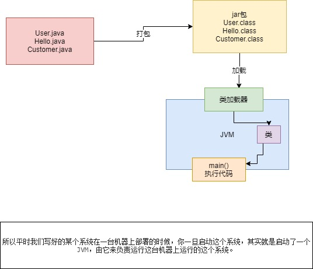
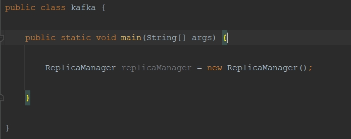
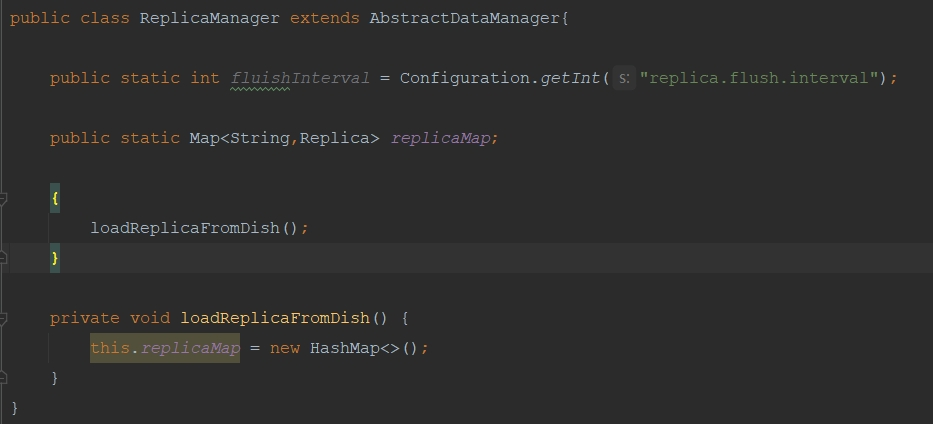

- [1、我们平时写的Java代码，到底是怎么运行起来的？](#1-我们平时写的java代码到底是怎么运行起来的)
- [2、 JVM类加载过程](#2-JVM类加载过程)

### 1、 我们平时写的java代码，到底是怎么运行起来的

  对于编译好的这些“.class”字节码，是怎么让他们运行起来的呢？
  
  这个时候就需要使用诸如“java -jar”之类的命令来运行我们写好的代码了。
  
  此时一旦你采用“java”命令，实际上此时就会启动一个JVM进程。
  
  这个JVM就会来负责运行这些“.class”字节码文件，也就相当于是负责运行我们写好的系统。
  
  所以平时我们写好的某个系统在一台机器上部署的时候，你一旦启动这个系统，其实就是启动了一个JVM，由它来负责运行这台机器上运行的这个系统。
  

### 2、 JVM类加载过程

一个类从加载到使用，一般会经历下面的这个过程：

加载 -> 验证 -> 准备 -> 解析 -> 初始化 -> 使用 -> 卸载

1、加载：你的代码中用到这个类的时候->会从“.class”字节码文件中加载这个类到JVM内存里来

2、验证阶段:简单来说，这一步就是根据Java虚拟机规范，来校验你加载进来的“.class”文件中的内容，是否符合指定的规范。

3、