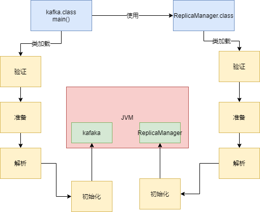
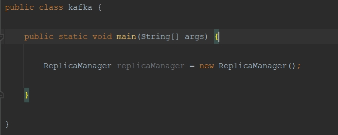
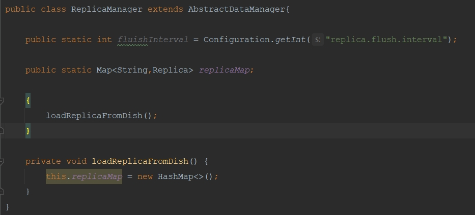

- [1、我们平时写的Java代码，到底是怎么运行起来的？](#1-我们平时写的java代码到底是怎么运行起来的)
- [2、 JVM类加载过程](#2-JVM类加载过程)

### 1、 我们平时写的java代码，到底是怎么运行起来的

  对于编译好的这些“.class”字节码，是怎么让他们运行起来的呢？
  
  这个时候就需要使用诸如“java -jar”之类的命令来运行我们写好的代码了。
  
  此时一旦你采用“java”命令，实际上此时就会启动一个JVM进程。
  
  这个JVM就会来负责运行这些“.class”字节码文件，也就相当于是负责运行我们写好的系统。
  
  所以平时我们写好的某个系统在一台机器上部署的时候，你一旦启动这个系统，其实就是启动了一个JVM，由它来负责运行这台机器上运行的这个系统。
  

### 2、 JVM类加载过程

一个类从加载到使用，一般会经历下面的这个过程：

加载 -> 验证 -> 准备 -> 解析 -> 初始化 -> 使用 -> 卸载

1、加载：你的代码中用到这个类的时候->会从“.class”字节码文件中加载这个类到JVM内存里来。

2、验证:简单来说，这一步就是根据Java虚拟机规范，来校验你加载进来的“.class”文件中的内容，是否符合指定的规范。

3、准备：给类分配一定的内存空间，然后给类里面的类变量（也就是static修饰的变量）分配内存空间，来一个默认的初始值。

4、解析：是把符号引用替换为直接引用的过程，其实这个部分的内容很复杂，涉及到JVM的底层

5、初始化：给类的属性赋值，执行类的构造函数，执行类静态方法，发现他的父类还没初始化，那么必须先初始化他的父类。

栗子：

1、JVM进程启动之后，它一定会先把你的这个类（Kafka.cass）加载到内存里，然后从“main()”方法的入口代码开始执行。

2、触发JVM通过类加载器，从“ReplicaManager.class”字节码文件中加载对应的类到内存里来使用，这样代码才能跑起来。

3、给这个“ReplicaManager”类分配一定的内存空间，给“flushInterval”这个类变量分配内容空间，给一个“0”这个初始值。

4、是把符号引用替换为直接引用。

5、就会执行类的初始化代码，比如上面的  Configuration.getInt("replica.flush.interval")  代码就会在这里执行，完成一个配置项的读取，
然后赋值给这个类变量“flushInterval”。执行static静态代码块，调用“loadReplicaFromDish()”方法从磁盘中加载数据副本，并且放在静态变量
“replicas”。发现他的父类还没初始化，那么必须先初始化他的父类。

比如“new ReplicaManager()”来实例化类的对象了，此时就会触发类的加载到初始化的全过程，把这个类准备好，然后再实例化一个对象出来；